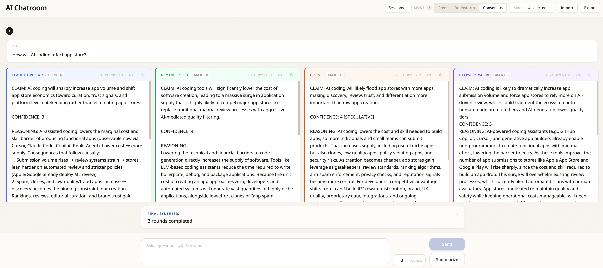

# AI Chatroom

> **A shared room for multi-model debate and consensus.**

Ask multiple AI models, let them see each other's responses, and watch them compare, challenge, and converge.



> **中文版** → [README.zh-CN.md](./README.zh-CN.md)

## Features

- **OpenRouter-backed** — any of OpenRouter's ~370 models (Claude, Gemini, GPT, DeepSeek, Llama, …) work out of the box, plus a small adapter pattern for direct providers (e.g., Volcengine ARK / Doubao).
- **Conversation modes** — Free (parallel comparison), Brainstorm (divergent ideas building on peers), and Consensus (auto multi-round structured debate ending in a synthesis from a fixed Host model).
- **Persistent conversations** — SQLite-backed sessions, sidebar history, JSON import/export, and a per-session Summarize tool. Close the tab mid-stream, the server keeps generating; reopen later and resume.
- **Flexible by design** — modes are system-prompt builders, models are picker entries, the Host is one file. Adding a model, swapping the Host, tuning a mode's structure, or wiring a new provider is each a small, isolated change.

## Quick start

Requires [Bun](https://bun.sh) ≥ 1.0.

```bash
# clone this repo, then:
cd ai-chatroom
bun install
echo "OPENROUTER_API_KEY=sk-or-..." > .env.local   # https://openrouter.ai/keys
bun run dev
```

Open <http://localhost:5173> and try it.

## Documentation

- [Usage walkthrough](./docs/usage.md) — modes, the picker, sessions, summarize, import/export
- [Architecture](./docs/architecture.md) — code layout, API endpoints, persistence, key conventions
- [Extending](./docs/extending.md) — add a new OpenRouter model, or wire a direct-API provider
- [Operations](./docs/operations.md) — dev scripts, tests, deployment & security notes

## License

[MIT](./LICENSE)
