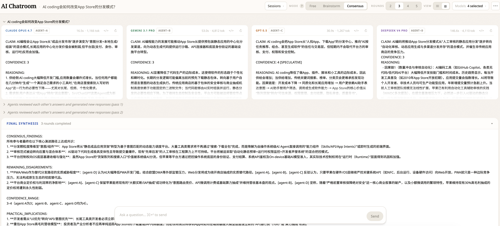

# AI Chatroom

> **A shared room for multi-model debate and consensus.**

让多个 AI 模型在同一个房间里互相看见、互相回应——一个问题抛进去，看它们如何对比、挑战、收敛。



> **English** → [README.md](./README.md)

## 功能

- **OpenRouter 全家桶** —— OpenRouter 的全部约 370 个模型（Claude、Gemini、GPT、DeepSeek、Llama……）开箱即用；外加一个轻量 adapter 模式，方便接入 OpenRouter 没有的直连 API（比如火山方舟 / 豆包）。
- **三种讨论模式** —— Free（并行对比）、Brainstorm（在同伴想法上接龙的发散讨论）、Consensus（自动多轮结构化辩论，由固定的 Host 模型在轮间总结、最后综合）。
- **会话持久化** —— SQLite 存储所有会话、轮次、消息、综合结果、总结；侧边栏可浏览历史；JSON 导入导出；流式中关 tab 服务器照样跑完，回来自动续接。
- **可扩展性优先** —— 模式只是 system prompt 构造函数，模型只是 picker 里的一项，Host 在一个文件里。加一个模型、换 Host、改某个模式的输出结构、对接一个新的服务商，都是一处局部小改动。

## 快速开始

需要 [Bun](https://bun.sh) ≥ 1.0。

```bash
# 克隆本仓库，然后：
cd ai-chatroom
bun install
echo "OPENROUTER_API_KEY=sk-or-..." > .env.local   # https://openrouter.ai/keys
bun run dev
```

打开 <http://localhost:5173> 体验。

## 文档

- [使用方式](./docs/zh-CN/usage.md) —— 模式、模型选择器、会话、总结、导入导出
- [架构](./docs/zh-CN/architecture.md) —— 代码结构、API 端点、持久化、关键约定
- [扩展](./docs/zh-CN/extending.md) —— 加新模型、对接新服务商、调模式 prompt
- [运维](./docs/zh-CN/operations.md) —— 开发脚本、测试、部署与安全

## License

[MIT](./LICENSE)
